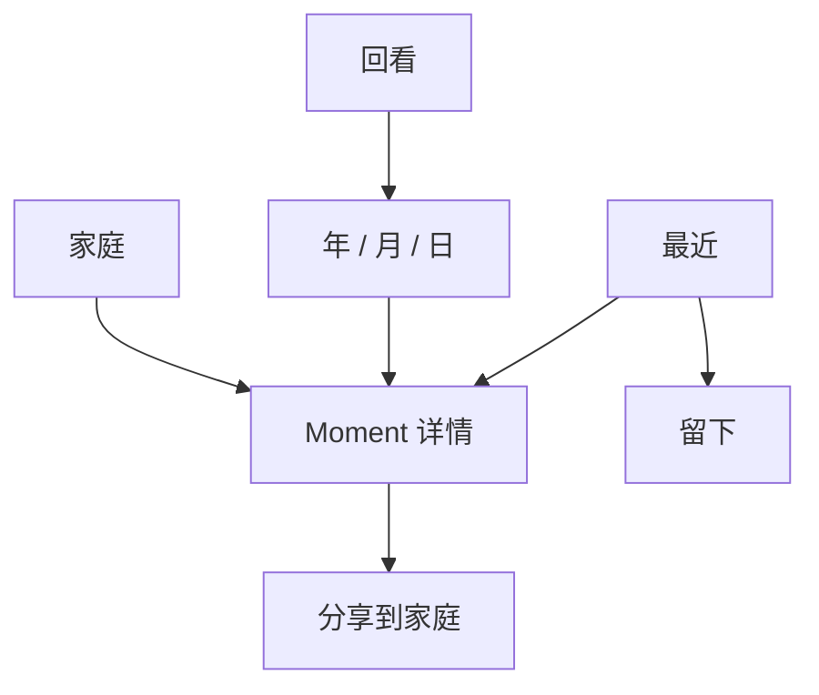

# Lampy APP 产品与体验设计指导文件

> 文档状态：MVP 开发基准（Draft 1.0）  
> 适用范围：Lampy iOS-first APP；后续可复用至 Android  
> 更新时间：2026-09-24  
> 用途：作为产品、设计、开发、测试共同遵循的指导文件  
> 优先级：当实现细节与本文的产品原则冲突时，应先回到产品价值和数据安全边界讨论，而不是用 UI 绕过问题。

---

## 0. 一页摘要

### Lampy 是什么

Lampy 是一个安静、私密、低负担的生活记录工具。用户可以用一句话、最多三张照片或一段声音，留下普通生活中的一个片刻；以后再按时间回到它，也可以明确地分享给自己的家庭空间。

### 核心价值主张

> **让今天随手留下的一点生活，在未来仍然能够被重新感受到。**

对外表达可以更直接：

> **这里，留下自己的生活。**  
> **A quiet place for the life you don’t post.**

Lampy 保存的是“不需要发布，却不应该消失的普通生活”。它比传统日记更轻，比相册更完整，比聊天记录更经得起时间。

### Lampy 不是什么

- 不是公开社交平台，也不是陌生人内容社区；
- 不是打卡、习惯养成或连续记录工具；
- 不是要求用户每天输出意义的日记模板；
- 不是照片管理器、文件夹或数据库界面；
- 不是纪念馆、数字遗产或告别产品；
- 不是情绪诊断、心理评估或正能量评分工具；
- 不是依靠 3D、粒子、毛玻璃和复杂动效制造高级感的展示品。

### MVP 最小功能集

1. 记录文字、音频和图片；支持手动输入、拍摄或从手机资源导入；每条记录最多三张图片；
2. 默认保存在“个人”，可明确分享到“家庭”；
3. 首页展示最近生活，历史页展示长期积累；
4. 仅支持“个人”和“家庭”两种范围；
5. 不实现 significance；
6. 将“情绪”重新定义为可选的“当时的感受”；
7. 可以为新 UI 增加 Projection / ViewModel，但不得破坏领域模型；
8. 从第一版开始支持横屏、平板、超大字号、VoiceOver 和减少动态效果。

---

## 1. 文档中的决策等级

为防止下一次开发会话误解，本文使用三种标记：

- **[已确认]**：来自既有讨论的明确约束，开发不得自行改变；
- **[推荐]**：本文件给出的 MVP 设计决策，可直接实现；若要改变，应记录为 ADR；
- **[待决定]**：必须在相关功能开发前确认，不应由开发者暗中假设。

---

## 2. 产品定义

### 2.1 用户问题

大量生活内容正在被保存，却很少真正被留下：

- 社交平台鼓励内容面对观众，普通片刻会因为“不值得发”而消失；
- 相册保存画面，却常常失去当时的一句话、声音和感受；
- 聊天保存了声音与关系，却会被大量消息淹没；
- 传统日记要求较完整的表达，开始成本和持续压力都偏高；
- 随着时间过去，人常常记得事件，却逐渐忘记一个人的声音、一个房间的环境声和普通一天的质感。

Lampy 解决的不是“如何生产更多内容”，而是：

> 如何让人以足够低的成本，保存不面向观众的真实生活，并在以后重新进入当时的一小段经验。

### 2.2 长期使用价值

单条记录可以很小，甚至只是十几秒声音或一句话。价值来自长期累积后形成的生活纹理：

- 用户曾经关注什么；
- 什么让他高兴、平静、感动、疲惫或难以描述；
- 他生活在怎样的环境中；
- 他听见、看见和经历过什么；
- 一段时间里，他是怎样生活的。

这种意义不应在记录时被强迫产生。Lampy 不问“这重要吗”，也不要求用户解释“为什么值得”。时间会自然改变普通内容的意义。

### 2.3 “温暖和美好”的位置

“传递温暖和美好”仍然可取，但它应是使用 Lampy 后可能产生的结果，而不是内容筛选标准或社交传播机制。

- 用户可以留下开心，也可以留下疲惫、平淡和说不清；
- 家庭成员之间可以因为听见、看见真实生活而感到温暖；
- 产品不要求内容必须积极、美好或适合展示；
- “向陌生人传递美好瞬间”不进入 Lampy 的价值主张，也不进入 MVP。

### 2.4 与相邻产品的区别

| 相邻产品 | 主要行为 | 内容面对谁 | Lampy 的区别 |
| --- | --- | --- | --- |
| Day One 等日记 | 较完整地书写与归档 | 自己 | Lampy 更轻、更日常，文字、照片和声音地位平等，减少字段和表单感 |
| 系统相册 | 拍摄、整理、搜索图片 | 自己/分享对象 | Lampy 保存画面之外的一句话、声音、感受和时间上下文 |
| 微信聊天 | 即时交流 | 某个人或群 | Lampy 按生活时间积累，不被工作消息和即时对话淹没 |
| 小红书、抖音、快手 | 发布、分发、互动 | 观众/算法 | Lampy 没有公开分发、热度和表演压力，保存的是自己的生活 |
| 习惯/打卡应用 | 形成连续行为 | 自己/群体 | Lampy 不奖励连续天数，不惩罚中断，不制造完成压力 |

一句内部定位判断：

> 社交平台记录的是“给别人看的生活”；Lampy 要帮助用户留下“不需要给别人看的生活”。

---

## 3. 目标用户与使用动机

### 3.1 主要用户

#### A. 想轻量留下日常的人

- 不愿写长日记；
- 有些内容不想发布；
- 希望以后能按时间回看；
- 更习惯用照片或声音而不是完整文字表达。

#### B. 重视私人家庭记忆的人

- 希望把少量真实片刻留给重要的人；
- 想分享家庭声音、日常照片和生活近况，但不想进入公开社交；
- 希望分享对象、分享范围和状态清楚可见。

#### C. 老年用户及其家庭

- 老年用户可能更愿意“说”而不是“写”；
- 儿女希望保存父母的声音和讲述，但必须尊重老人作为记录者和授权者；
- 大字号、清晰触控、简单路径和错误可恢复不是附加功能，而是基础质量。

### 3.2 关键 Jobs to Be Done

- 当我遇到一个不值得发朋友圈、但不想彻底忘记的片刻时，我想在几十秒内留下它；
- 当我不想写字时，我想直接留下现场的声音或一张照片；
- 当时间过去后，我想从某年、某月或某天自然找到当时的生活；
- 当我想让家人看见某一条内容时，我想明确选择范围，而不是自动公开；
- 当我多年后再打开时，我想感受到当时，而不是阅读一张数据详情表；
- 当我操作不熟练、字体很大或设备横放时，我仍然能安全完成记录。

---

## 4. 产品原则

### 4.1 普通生活天然值得被保留

产品不使用“完成度”“重要性”“精彩程度”判断内容。空白、间隔、平淡和中断都是生活的一部分。

### 4.2 记录要轻，回看要深

创建时尽量少做决定；随着时间积累，历史结构应帮助用户重新建立上下文。

### 4.3 私密默认，分享明确

新记录默认属于个人。分享到家庭必须是可理解、可确认的主动行为。界面不能让用户猜测谁能看到。

### 4.4 内容先于界面

文字、照片和声音是主体。日期组织时间，界面负责留白、节奏和关联，不把所有内容塞入同尺寸 Card。

### 4.5 不用压力换留存

不提供连续记录天数、漏记警告、排行榜、积极情绪比例或催促式推送。产品留存来自“以后重新感受到”的真实价值。

### 4.6 数据安全高于视觉连续性

媒体缺失时保留 Moment；加载失败时不伪造数据；找不到指定 Moment 时不跳到另一条；页面错误不覆盖、删除或篡改原始内容。

### 4.7 长期安静，而非短期惊艳

设计应在五年后浏览时仍成立。复杂 3D、炫技动画和拟物装饰不能成为导航或理解内容的前提。

---

## 5. MVP 范围

### 5.1 必须实现

#### 记录

- 纯文字；
- 单张或多张图片，最多三张；
- 单段声音；
- 文字、图片和声音的组合；
- 从相机/照片库导入图片；
- 现场录音；若现有领域能力支持导入音频，可开放文件导入，否则不得用伪入口暗示；
- 自动保存本地草稿，快速退出不丢失；
- 权限拒绝、媒体处理失败、保存失败的可恢复状态。

#### 浏览

- 首页：最近生活；
- 历史：年、月、日层级的时间积累；
- Moment 只读详情；
- 返回时保持原有时间和滚动位置；
- 媒体缺失降级，不隐藏整条记录。

#### 家庭

- 个人与家庭两个范围；
- 用户主动把一条已存在记录分享给家庭；
- 展示来自家庭范围且当前用户有权读取的内容；
- 所有送达、撤回、状态展示必须来自真实 Transmission 能力，不伪造联系人或成功状态。

#### 基础质量

- 本地优先；
- 横屏、平板、多窗口尺寸；
- iOS Dynamic Type 超大字号；
- VoiceOver；
- Reduce Motion；
- 关键操作可通过键盘/开关控制完成；
- 明确的加载、空、失败和不可用状态。

### 5.2 明确不做

- significance 或任何“重要程度”评分；
- 陌生人发现、随机传递、公开主页、公开动态；
- 点赞、评论、粉丝、排行榜、热度；
- 连续记录奖励或漏记惩罚；
- AI 总结、AI 情绪判断、自动生成回忆；
- Mood 趋势、积极率、心理诊断；
- 编辑或删除详情中的领域内容（当前详情只读）；
- 未经现有能力确认的真实送达、家庭云空间或联系人体系；
- 以遗产、告别、纪念馆为核心的叙事；
- 把 3D 作为核心浏览或创建方式。

---

## 6. 产品语言

### 6.1 语言原则

- 像真实的人会说的话，不造一套需要学习的诗意词汇；
- 温暖但不煽情，精致但不故作诗意；
- 不要求每一天都有意义；
- 不使用“发布、动态、粉丝、互动、内容创作”等社交平台语言；
- 不使用“文件、条目、资源、归档、同步任务”等管理系统语言；
- 不继续依赖“光”作为唯一隐喻；
- 错误文案先说明内容是否安全，再说明能做什么。

### 6.2 MVP 推荐词汇

| 概念 | 推荐表达 | 避免表达 |
| --- | --- | --- |
| APP 首页 | 最近 | 动态、信息流、光墙 |
| 创建动作 | 留下 | 发布、打卡、创建条目、点亮 |
| 单条内容 | 一条记录 / 省略名词直接展示内容 | 微光、帖子、作品 |
| 历史空间 | 回看 | 光罐、档案库、数据库 |
| 家庭范围 | 家庭 | 圈子、社群、粉丝组 |
| 个人范围 | 个人 | 私密模式（容易像临时状态） |
| 详情标题 | 日期或时间，例如“9月21日，星期一” | 记录详情、Moment Detail |
| 草稿 | 还没保存的内容 | 未提交数据、草稿对象 |
| 感受 | 当时的感受 | 情绪值、心情指数 |

这些词是 **[推荐]** 的展示层语言，不要求重命名 Moment、Asset、Transmission、存储 Key 或迁移结构。

### 6.3 关键文案样例

#### 第一次使用

标题：`这里，留下自己的生活。`  
说明：`写一句，拍一张，或留一段声音。以后再回来听见、看见。`  
主操作：`留下第一条`

#### 空首页

标题：`最近还没有留下什么。`  
说明：`不必想好要写什么。一句话、一张照片或一段声音都可以。`

#### 很久没有记录

`欢迎回来。今天想留下什么都可以。`

禁止出现“已中断 X 天”“重新开始连续记录”。

#### 保存成功

`已经留下。`

若仅本地保存：`已经保存在这台设备上。`  
不得在未真实送达时写“家人已收到”。

#### 草稿恢复

`上次还有一些内容没保存，已经为你放回来了。`  
操作：`继续` / `放弃这份草稿`

“放弃”必须二次确认，并清楚说明将移除哪些本地草稿内容。

#### 图片缺失

`这张照片暂时找不到了，但这条记录还在。`

#### 声音不可播放

`这段声音暂时无法播放，其他内容仍然保留。`

#### Moment 不存在

`这条记录现在无法找到。`  
操作：`返回原来的位置`

不得展示其他记录作为替代。

#### 家庭分享

确认标题：`分享到家庭？`  
说明：`家庭中的成员将能看见这条记录。`  
操作：`分享` / `暂不分享`

家庭不是经过血缘验证的身份。相关说明应写成：`“家庭”是由用户邀请组成的私人空间，Lampy 不验证成员之间的真实亲属关系。`

---

## 7. 重新定义“情绪”

### 7.1 定义

MVP 不把情绪当作分析对象、指标或记录任务，而把它改成一个完全可选的上下文：

> **当时的感受：用户愿意时，为这一刻留下的一个轻量描述。**

### 7.2 交互原则

- 默认不出现强制提问，不阻塞保存；
- 不以正面/负面二分，不使用红绿评分；
- 不计算趋势、积极率或周报；
- 不由 AI 猜测；
- 用户可以跳过、清除；
- 详情中作为次要上下文出现，不能压过原始文字、图片和声音；
- 不使用诊断性术语。

### 7.3 MVP 推荐词表

`高兴`、`平静`、`感动`、`疲惫`、`难过`、`烦乱`、`说不清`

该词表用于降低输入成本，不宣称覆盖全部感受，也不按好坏排序。视觉上使用相同权重，不为不同感受绑定永久颜色。

### 7.4 实现边界

若现有 Moment 已有 emotion 字段，展示层可以通过 ViewModel 映射为“当时的感受”；未知旧值必须安全显示，不能静默丢弃。若领域结构不支持上述语义，应先写 ADR 和迁移方案，不能为了 UI 直接改底层数据。

---

## 8. 信息架构

### 8.1 一级空间

MVP 推荐三个一级目的地：

1. **最近**：看见近期生活，也是最自然的记录入口；
2. **回看**：从年、月、日进入长期积累；
3. **家庭**：查看明确分享到家庭或从家庭收到的内容。

设置从一级页面的常规导航入口进入，不占据主导航位置。

### 8.2 “留下”如何进入

“留下”是行为，不是第四个内容空间。它不采用遮挡内容的悬浮圆形按钮。推荐：

- 首页顶部或最近内容之后有稳定、可触达的文字动作“留下”；
- iPhone 可在底部安全区提供不悬浮、不遮挡内容的安静操作带；
- iPad 可在双栏布局的侧栏或内容页顶部提供同一动作；
- 所有入口进入同一个创建状态，不预先要求选择文字/照片/声音类型。

### 8.3 导航关系



返回行为必须恢复原页面的滚动位置、时间范围和选择状态。

---

## 9. 核心用户旅程

### 9.1 第一次留下内容

1. 用户进入“最近”，看见简短说明和“留下第一条”；
2. 进入一个空白但不是表单的创作面；
3. 直接写一句、拍/选图片或录一段声音；
4. 用户可混合内容，不必选择记录类型；
5. 保存前默认范围为“个人”；
6. 保存成功后回到最近，新内容在原有时间位置轻柔出现；
7. 不弹出打卡、分享、评分或邀请通知。

目标：用户不阅读教程也能在一分钟内完成第一条纯文字、照片或声音记录。

### 9.2 快速留下声音

1. 点击“留下”；
2. 点击声音入口，首次请求麦克风权限；
3. 录制界面只显示必要的录制状态、时长、停止和取消；
4. 录制结束后可试听、重录或保存；
5. 波形是反馈，不是装饰；
6. 中断、来电、权限拒绝或写入失败时，明确说明现有内容是否保留。

### 9.3 恢复草稿

1. 创建过程中离开、崩溃或被系统终止；
2. 下次进入创建页时恢复本地草稿；
3. 明确提示“已经为你放回来了”；
4. 用户继续或主动放弃；
5. 草稿恢复不得生成重复 Moment，也不得自动分享。

### 9.4 从一年回到某一天

1. 用户在“回看”看到一年中的记录疏密；
2. 选择某月，看到日期节奏而不是缩略图墙；
3. 选择某日，展开当天自然组合；
4. 打开一条 Moment；
5. 返回后仍处于原年份、月份、日期和滚动位置。

### 9.5 分享给家庭

1. 用户从个人 Moment 详情发起分享；
2. 界面清楚显示目标范围“家庭”；
3. 用户确认；
4. Service 创建或更新真实 Transmission；
5. UI 只展示服务返回的真实状态；
6. 失败时 Moment 仍保留在个人范围，允许重试，不制造“已送达”假象。

### 9.6 老年用户留下讲述

1. 以超大字号打开首页，仍能在首屏找到“留下”；
2. 进入创建页后可直接录音，不必先填写标题或标签；
3. 触控目标足够大，录制状态同时使用文字、形状和声音/触觉反馈；
4. 保存范围默认为个人；
5. 分享家庭时再次明确确认，避免误分享；
6. 辅助操作必须建立在本人知情和授权上。

---

## 10. 页面设计

每个页面都应先回答：它承载哪种生活行为、什么先被看见、什么应弱化、内容很多或没有内容时是否仍然安静。组件只能服务这些答案。

### 10.1 启动与 Splash

#### 行为目标

尽快进入最近生活，同时建立安静、可信的第一印象。

#### 设计

- 原生 Launch Screen 只使用稳定底色和简洁 Lampy 标识，不放依赖加载的内容；
- APP 内容加载后，品牌层以 300–450ms 淡出，首页日期和结构已经在最终位置；
- 首次使用可在首页内容层呈现产品说明，不用强制播放长动画；
- 用户触摸、Reduce Motion、恢复前台或页面返回时立即结束/跳过；
- Splash 失败不能阻塞首页，也不能被当作数据加载状态。

#### 禁止

- 独立夜空、粒子、发光球、3D 标志长动画；
- 每次返回首页重播；
- 为动画锁住整页超过必要时间；
- 日期和首页内容在不同坐标间跳动。

### 10.2 首页：最近

#### 承载行为

让用户先看见最近的生活，感到内容正在积累，并自然地继续记录。

#### 第一视觉

最近一天的真实内容，而不是运营标题、统计数字或功能入口矩阵。日期是版面结构的一部分。

#### 页面结构

- 顶部：当前时间语境和安静的“留下”动作；
- 主体：最近若干天，按日期形成不等高的生活段落；
- 同一天的文字、照片和声音形成自然组合；
- 更早内容逐渐收束，用“回看”进入长期结构；
- 积累感通过时间跨度和疏密表达，不用“已记录 365 天”制造压力。

#### 数量适配

- **第一次使用**：说明价值 + 单一主操作；
- **一条记录**：给内容充分空间，不用空 Card 填满页面；
- **同日多条**：共享一个日期锚点，内部用留白和媒介关系分组；
- **连续多日**：日期节奏清楚，但不做机械等距列表；
- **很久未记录**：直接欢迎回来，不突出间隔时长；
- **一年后**：首页仍只负责最近，避免变成无限信息流。

#### 去 Card 检查

去掉所有圆角和边框后，仍应能仅靠日期、排版、内容比例和留白理解结构。

### 10.3 创建记录：留下

#### 承载行为

在最低决策成本下，把文字、画面和声音放进同一个生活片刻。

#### 页面结构

- 页面像一张正在形成的生活页，而不是字段集合；
- 用户进入后即可输入文字，但不显示“内容”字段标题和输入框边框；
- 图片和声音作为内容本身插入页面，而不是作为附件列表；
- 媒体入口靠近当前创作位置，最多保留必要的“照片”“声音”；
- 不先选择模板或记录类型；
- 保存动作明确但不抢占内容；
- “个人/家庭”不作为创建前的强制步骤。MVP 推荐先保存到个人，再由用户明确分享。

#### 图片规则

- 最多三张；达到上限后解释“每条最多三张照片”；
- 保留原始宽高比，编辑预览可以裁切但不得无提示破坏原文件；
- 删除图片只影响当前草稿关联，不得误删底层其他 Moment 使用的 Asset；
- 导入失败时保留其他文字、声音和已成功图片。

#### 声音规则

- 录制中显示明确状态和持续时间；
- 支持停止、取消、试听、重录；
- 不使用装饰性随机波形冒充真实音频；
- 无权限时说明如何继续使用文字和照片，不让整页失效；
- 保存失败时说明录音临时文件是否仍保留。

#### 键盘与安全区

- 保存和媒体操作不能被键盘或 Home Indicator 遮挡；
- 超大字号时操作可以换行或纵向排列，不能缩小文字；
- 横屏短高度时内容可滚动，主操作始终可达，但不悬浮遮住内容。

### 10.4 历史：回看

#### 承载行为

先感知一段时间的生活疏密，再自然进入某月、某日和某条记录。

#### 年

- 表达哪些时间留下过内容、哪些时间安静；
- 使用克制的时间纹理或密度带，不做数据仪表盘和打卡热力图；
- 无记录的月份保留真实空间，不用红色缺口或“未完成”。

#### 月

- 日期成为节奏骨架；
- 有内容的日子通过内容痕迹、媒介提示或排版密度区分；
- 不默认使用标准 Tabs + 等高列表；
- 超大字号下从二维月份结构自然降级为按周/日期的纵向结构。

#### 日

- 当天内容共享日期标题；
- 多条 Moment 以真实时间（若存在）和内容关系展开；
- 时间精度不足时不能伪造具体时刻；
- 同日空白不需要提示，整月为空时使用中性说明。

#### 时间精度

UI 必须尊重领域提供的精度：精确时间、日期、月份、年份或未知。记录创建时间不得冒充实际发生时间。

### 10.5 Moment 详情

#### 承载行为

让用户重新进入当时的一小段生活，而不是查看数据库字段。

#### 内容顺序

顺序应由内容关系决定，而不是固定 Card：

- 日期/时间作为进入点；
- 主媒介（照片或声音）获得合适空间；
- 文字与媒介保持叙事关系；
- “当时的感受”、来源和范围属于次要信息；
- 家庭分享动作位于内容之后，不伪装为社交互动。

#### 媒介组合

- 纯文字：通过行宽、字号和留白承载，不放进大白框；
- 单图：尊重原始比例和画面中心；
- 多图：最多三图，组合由图片比例决定，不随机旋转；
- 单段声音：保留播放、暂停和时长，视觉像“听见当时”；
- 混合内容：声音和图片可共享一个时间场景，避免拆成附件清单。

#### 错误与缺失

- 图片缺失只替换对应图片位置；
- 声音失败只禁用对应播放能力；
- Moment 不存在时显示独立错误页并返回原位置；
- 加载失败不展示 mock、不回退到第一条或相邻记录；
- 当前详情只读。

### 10.6 家庭

#### 承载行为

查看被明确放入家庭范围的真实生活，而不是建立一个社交 feed。

#### 页面原则

- 不显示热度、评论、点赞、在线状态和排行榜；
- 不制造虚假联系人或推荐成员；
- 内容按时间和来源关系组织，但不强调“谁更活跃”；
- 个人内容与家庭内容的范围必须持续可辨；
- 空状态解释如何由本人主动分享，不诱导邀请陌生人；
- “家庭”是用户邀请形成的私人空间，不宣称验证真实亲属关系。

#### UGC 与安全

家庭分享仍属于用户生成内容。公开发布前必须单独完成平台审核要求、举报/屏蔽/成员管理、隐私政策和儿童/未成年人保护评估。该评估是发布门槛，不得用“我们叫家庭”替代合规判断。

---

## 11. 页面状态矩阵

| 页面 | 正常 | 空 | 加载 | 可恢复错误 | 不可用/缺失 |
| --- | --- | --- | --- | --- | --- |
| 最近 | 最近日期与混合媒介 | 首次使用 / 暂无记录 | 骨架只保留最终布局 | 读取失败，提供重试 | 个别媒体原位降级 |
| 留下 | 文字/图/声音组合 | 空白创作面 | 媒体处理中就地反馈 | 权限、导入、录音、保存失败 | Asset 不可用但草稿其他内容保留 |
| 回看 | 年/月/日结构 | 中性时间空白 | 保持当前时间结构 | 重试并保留所选时间 | 缺失 Moment 不用其他内容替代 |
| 详情 | 完整 Moment | 不适用 | 内容原位占位 | 系统错误后重试 | 图片/声音分别降级；Moment 不存在独立处理 |
| 家庭 | 真实共享内容 | 尚无共享内容 | 保持页面结构 | 读取/Transmission 失败 | 不伪造送达或成员 |

所有错误状态必须回答：

1. 原始内容是否仍安全；
2. 哪一部分失败；
3. 用户现在能做什么；
4. 重试会不会重复创建或重复分享。

---

## 12. 视觉方向：时间中的生活版面

### 12.1 核心体验

像翻到一本长期使用、被认真保存的生活册：内容直接存在于页面中，时间和留白形成秩序，照片与声音保留自己的质感。

这不是仿手账，也不是纸张拟物。生活感来自真实内容的疏密、比例和时间关系。

### 12.2 空间组织

- 使用一条清晰但不机械的版面网格；
- 日期可以占据边缘、跨栏或成为段落起点；
- 同一天内容共享时间结构，不重复贴日期标签；
- 页面密度随真实内容变化，但变化规则可预测；
- iPhone 以单栏时间版面为主；iPad 可使用时间导航 + 内容双栏，不能简单拉宽手机 Card。

### 12.3 文字

- 文字像“被留在这里的一句话”，而不是输入框里的值；
- 控制舒适行宽：正文约 28–38 个中文字符/行，英文约 45–70 characters/line；
- 标题依赖尺寸、位置和留白建立层级，少用粗体堆叠；
- 超大字号允许版面重排，不截断核心内容。

### 12.4 图片

- 尊重原图比例、方向、颜色和颗粒；
- 不统一裁成商品缩略图；
- 多图组合由数量和宽高比决定，规则稳定；
- 允许小图和大图形成节奏，但不随机旋转、叠贴或模拟胶带；
- 营销图片与用户内容分开：APP 中不应用生成图替代用户真实记录。

### 12.5 声音

- 必须有播放/暂停、时长、加载、失败等必要状态；
- 波形/声迹是时间的可视线索，若不是真实采样则使用明确的中性进度线；
- 控件整体融入文字和日期，不做标准媒体工具栏外观；
- VoiceOver 读出“播放/暂停、当前进度、总时长、录制日期”。

### 12.6 色彩

色彩用来区分语义和媒介气质，不用来装饰每一段文字。建议比例：约 85% 深墨色，10% 中性次级文字，5% 克制强调色。

| Token | 建议值 | 用途 |
| --- | --- | --- |
| `paper` | `#F3F0E9` | 主背景 |
| `paper-deep` | `#E8E1D5` | 时间段落或历史区域背景 |
| `ink` | `#25231F` | 标题与正文 |
| `ink-soft` | `#5C5851` | 次要说明 |
| `sage` | `#53604F` | 时间、家庭或安静状态的可访问文本强调 |
| `sage-surface` | `#7D8974` | 大面积非文字视觉元素 |
| `clay` | `#87513D` | 少量价值句、温度提示 |
| `sound` | `#4F626D` | 声音交互与波形 |
| `hairline` | `rgba(37,35,31,0.16)` | 必要分隔 |

要求：正文对背景至少满足 WCAG AA；不能仅靠颜色表达范围、错误、播放或选中状态。暗色模式在 MVP 是否发布见“待决定”，但 Token 命名不得绑定具体明暗值。

### 12.7 形状与材质

- 不建立“所有内容都是圆角卡片”的语法；
- 圆角只用于确有触控/裁切/系统语义的区域；
- 阴影尽量不用；层级优先通过留白、底色和位置表达；
- 禁止毛玻璃泛滥、强渐变、装饰贴纸、撕纸、胶带、仿手写字体和故意做旧；
- 少量不规则必须来自图片比例、文字长度、声音时长和时间间隔，而不是随机数。

### 12.8 图标

- 优先使用平台熟悉且可访问的线性图标；
- 图标必须配合可读标签，尤其是创建、分享、录音等关键动作；
- 不用抽象“光点”承担用户无法猜测的导航含义。

---

## 13. 响应式与无障碍

### 13.1 断点不是设备名称，而是可用空间

- **紧凑宽度**：单栏；
- **常规宽度**：内容与时间辅助信息可双栏；
- **横屏短高度**：减少非必要顶部空间，保留内容滚动和操作可达；
- **多窗口/分屏**：布局按实际宽度重排，不假设全屏 iPad。

### 13.2 Dynamic Type

- 支持系统最大辅助字号；
- 不缩放文字来强塞进原布局；
- 日期、操作和媒介说明可以换行、堆叠；
- 年/月二维布局在大字号下转换为纵向时间列表；
- 不将重要文字绘制进图片或 Canvas；
- 关键文案不做单行截断。

### 13.3 触控与输入

- iOS 触控目标建议至少 44×44pt；面向老年用户的主操作推荐更大；
- 相邻危险操作保持足够距离；
- 删除草稿、取消录音、离开未保存内容有清晰结果；
- 支持 Voice Control 的稳定可读标签；
- 外接键盘下可完成基础导航、保存、播放和返回。

### 13.4 VoiceOver

- 阅读顺序遵循日期 → 内容 → 媒体控制 → 次要信息 → 操作；
- 图片使用用户可编辑描述不是 MVP 必需项，但系统不能把文件名当作有意义描述；无描述时读“照片 1/3”；
- 组合图片需说明数量；
- 声音控制必须暴露状态和时长；
- 时间密度视图必须提供等价的日期列表或可访问摘要。

### 13.5 减少动态与对比度

- Reduce Motion 下取消位移、缩放和共享元素飞行，只保留即时状态切换或极短淡变；
- Increase Contrast 下增强分隔和次要文字；
- Differentiate Without Color 下用文字、形状或图标补充范围与状态。

---

## 14. 动效规范

动效表达“被留下”“时间展开”“过去重新出现”和“位置连续”，不能拖延完成任务。

| 场景 | 触发 | 时长 | 缓动 | 变化范围 | 可取消/降级 | 触摸影响 |
| --- | --- | ---: | --- | --- | --- | --- |
| 启动进入首页 | 冷启动内容可用 | 300–450ms | ease-out | 品牌层透明度 1→0；首页不超过 4pt 位移 | 触摸/Reduce Motion 立即完成 | 不阻塞首页 |
| 保存成功 | Service 确认成功 | 180–240ms | ease-out | 新内容透明度 0→1，位移 ≤6pt | Reduce Motion 直接出现 | 不阻塞后续操作 |
| 展开某日 | 用户选择日期 | 220–320ms | ease-in-out | 时间结构展开，位移 ≤12pt | 可返回中断；降级为切页 | 动画中可返回 |
| 进入详情 | 用户打开 Moment | 220–300ms | ease-out | 日期/主媒介保持空间连续 | 低性能设备普通 push | 不创建透明触摸层 |
| 播放声音 | 点击播放 | 即时 + 连续进度 | linear（仅进度） | 进度线/真实波形 | 后台或中断时停止更新 | 控件持续可操作 |
| 页面内容显现 | 首次进入视口 | 180–260ms | ease-out | 透明度 0.88→1，位移 ≤6pt | 每项只执行一次；Reduce Motion 关闭 | 不淡出已读内容 |

禁止：大面积粒子、无限漂浮、随机移动、随机旋转、滚动时反复淡入淡出、保存前强制播放庆祝动画、依赖 60fps 3D 才能理解结构。

### 14.1 3D 的使用边界

MVP 不使用 3D 作为核心界面。后续实验只有同时满足以下条件才可进入产品评估：

- 直接帮助理解时间、空间或某段生活，而非品牌炫技；
- 不隐藏文字、图片和声音；
- 不影响老年用户、晕动敏感用户和 Reduce Motion；
- 低性能设备有完全等价的二维路径；
- 性能、功耗和可访问性通过真机验证。

---

## 15. 数据与领域边界

### 15.1 不可破坏的约束

- Moment 是核心领域实体；
- Asset 独立存在，Moment 只保存 Asset ID；
- Transmission 是独立实体；
- 页面通过 Service 和 Projection 获取 ViewModel；
- UI 不直接读写底层 Repository 或存储；
- 记录创建时间不能冒充内容实际发生时间；
- 缺失媒体不能导致整个 Moment 消失；
- 找不到指定 Moment 时不能回退到其他记录；
- 页面失败不能覆盖、删除或“修复”原始数据；
- 当前详情页只读；
- 展示层改词不等于领域实体、存储 Key 或迁移结构改名。

### 15.2 推荐 Projection / ViewModel

允许为新 UI 增加只读 Projection 和页面 ViewModel：

#### `RecentLifeViewModel`

- 最近日期分组；
- 每组 Moment 摘要；
- 媒体可用状态；
- 是否首次使用；
- 是否可继续加载；
- 不包含意义评分和连续天数。

#### `MomentComposerViewModel`

- 当前文字；
- 最多三张图片的草稿 Asset 引用与处理状态；
- 录音草稿引用、时长和状态；
- 可选“当时的感受”；
- 草稿持久化状态；
- 保存状态和可恢复错误；
- 默认目标范围为个人。

#### `HistoryOverviewViewModel`

- 年/月/日可用范围；
- 日期上的 Moment 数量和媒介类型摘要；
- 时间精度；
- 导航位置恢复标识；
- 空时间段真实呈现，不补齐虚假记录。

#### `MomentDetailViewModel`

- 精确 Moment ID；
- 时间与精度；
- 文字；
- 感受展示值；
- 图片/声音 Asset ViewModel；
- 每个 Asset 独立可用状态；
- 来源（创建、导入、收到等，限领域真实值）；
- 个人/家庭范围和真实 Transmission 状态；
- 不存在与加载失败必须是不同状态。

#### `FamilyTimelineViewModel`

- 当前用户有权读取的家庭内容；
- 真实来源与时间；
- 真实 Transmission 状态；
- 不计算社交热度，不生成推荐成员。

### 15.3 媒体状态建议

UI 至少区分：`available`、`processing`、`temporarilyUnavailable`、`missing`、`failed`。状态命名可按代码规范调整，但不能把“找不到”“尚未下载”“解码失败”全部当作 Moment 不存在。

### 15.4 写入原则

- 保存 Moment、Asset、Transmission 应由领域 Service 协调；
- 媒体写入与 Moment 关联要有可恢复策略，避免产生用户不可见的半成品；
- 重试必须幂等或明确防止重复记录/重复分享；
- 草稿与正式 Moment 分离；
- 日志不得记录私人正文、原始音频或图片内容。

---

## 16. 隐私、家庭与信任

### 16.1 默认规则

- 新内容默认个人；
- 分享必须明确选择家庭并确认；
- 相机、照片、麦克风权限在用户触发对应动作时请求；
- 拒绝权限后，其余记录方式仍可使用；
- 权限说明讲清用途，不用恐吓或诱导。

### 16.2 家庭的产品定义

Lampy 无法也不应宣称验证用户是否具有真实亲属关系。“家庭”是一个由用户邀请、带明确边界的私人分享空间。

因此：

- 不对成员关系作血缘真实性背书；
- 不把“家庭”当作规避 UGC 责任的标签；
- 不把个人内容默认同步给家庭；
- 不让家庭管理员在未经授权时替他人创建私人记录；
- 老年用户仍是本人内容的主体，不是被收集的对象。

### 16.3 发布前安全门槛

在 App Store / Play 商店公开发布家庭分享前，应基于届时政策和目标地区法规专项核查：内容举报、成员移除/屏蔽、未成年人保护、隐私披露、数据删除、账号删除和内容处理机制。本文不以产品概念替代法律或商店审核意见。

---

## 17. 技术实现指导（非架构最终决议）

### 17.1 推荐栈

考虑开发者熟悉 TypeScript / React，iOS-first MVP 推荐：

- React Native；
- Expo Development Build，而不是长期停留在受限沙盒预览；
- TypeScript 严格模式；
- 本地 SQLite 保存结构化领域数据；
- 平台文件系统保存图片和音频；
- iOS 原生能力用于相机、照片、麦克风、音频会话、后台中断、Dynamic Type、VoiceOver 和安全区；
- local-first，网络/家庭同步与领域层隔离。

技术栈属于 **[推荐]**，进入开发前应写 Architecture Decision Record，确认现有微信小程序领域代码中哪些是纯 TypeScript 可复用、哪些与微信 API 耦合需要适配。

### 17.2 目录边界建议

```text
src/
  domain/          # 纯领域规则，不依赖 React Native
  application/     # Services / use cases
  infrastructure/  # SQLite、文件、权限、平台适配
  projections/     # 页面所需只读投影
  features/        # recent、composer、history、detail、family
  ui/              # tokens、基础排版、可访问 primitives
  navigation/      # 路由与位置恢复
```

不要为了复用小程序 UI 而复制 WXML/WXSS 的页面结构；应复用已验证的领域规则、测试样例和数据约束。

### 17.3 原生验证要求

模拟器不能替代真机，尤其是：

- 麦克风录制与音频会话中断；
- 相机和照片权限；
- 后台/前台切换；
- 文件丢失、空间不足、系统清理；
- 超大字号和 VoiceOver；
- 横屏、iPad 分屏；
- 低性能设备动效；
- 家庭分享的真实网络失败和幂等性。

---

## 18. 成功指标

Lampy 不以“刷得更久”作为成功。MVP 更合适的指标是功能价值与可靠性：

### 18.1 核心指标

- 首次用户完成第一条记录的比例；
- 从进入创建到成功保存的耗时分布；
- 文字、图片、声音三种方式的成功率；
- 草稿恢复成功率；
- 保存失败后恢复/重试成功率；
- 从历史打开旧 Moment 的用户比例；
- 声音再次播放成功率；
- 家庭分享创建成功率与重复 Transmission 率；
- 媒体缺失时 Moment 仍可见的正确率；
- 超大字号、VoiceOver 和横屏关键流程通过率。

### 18.2 不采用的指标

- 连续记录天数；
- 每日必须记录率；
- 正面情绪占比；
- 人均浏览时长越长越好；
- 社交互动数、点赞、粉丝或内容热度。

### 18.3 分析隐私

分析事件只记录必要的功能状态和匿名技术结果，不上传正文、图片内容、音频内容、感受文本或联系人信息。埋点方案需单独审查。

---

## 19. 实施顺序

### Phase 0：领域与平台审计

- 对照现有 Moment / Asset / Transmission / Service / Projection；
- 标记纯 TypeScript 可复用代码与微信平台耦合；
- 确认时间精度、emotion 旧值、Asset 生命周期、草稿和 Transmission 真实能力；
- 建立 ADR、Decision Log、Open Questions；
- 建立 iOS 真机开发和签名环境。

### Phase 1：垂直闭环

- 原生导航壳；
- 最近空状态；
- 非表单式创建页；
- 纯文字、单图、单段声音；
- 本地草稿；
- 保存为个人 Moment；
- 最近页立即出现；
- 只读详情；
- 数据保全自动化测试。

### Phase 2：完整 MVP 媒体与历史

- 最多三图和混合媒介；
- 权限与媒体失败；
- 年/月/日回看；
- 位置恢复；
- 媒体缺失降级；
- “当时的感受”；
- 横屏、iPad、超大字号和 VoiceOver 完整验收。

### Phase 3：家庭

- 真实家庭成员/范围能力审计；
- 分享确认和 Transmission；
- 家庭时间页；
- 失败与幂等；
- 隐私、UGC、商店审核要求；
- 不引入公开社交。

### Phase 4：品质与发布

- 动效与 Reduce Motion；
- 性能、内存、磁盘和音频中断；
- 数据迁移与恢复；
- 隐私清单、账号/数据删除策略；
- TestFlight 真机矩阵；
- App Store 素材与审核说明。

---

## 20. UI 验收清单

每个页面都必须逐项回答：

### 20.1 反模板检查

- [ ] 页面不是由多个圆角 Card 组成；
- [ ] 不只是换了一套暖色模板；
- [ ] 不像表单、信息流或后台系统；
- [ ] 不过度依赖输入框、标签页和悬浮按钮；
- [ ] 内容尺寸和节奏会因真实媒介与时间合理变化；
- [ ] 生活感来自结构，不来自贴纸、做旧和装饰；
- [ ] 页面不能换 Logo 后直接用于任意日记产品；
- [ ] 普通生活不会显得“不够值得记录”；
- [ ] 不制造连续记录或积极情绪压力；
- [ ] 尊重真实照片、声音和文字；
- [ ] 五年后大量内容仍可浏览；
- [ ] 能在 iOS 真机可靠实现并降级。

前三项只要任一为“否”，页面不得进入最终方案。

### 20.2 数据安全检查

- [ ] UI 只通过 Service / Projection 读写；
- [ ] Moment ID 精确路由；
- [ ] 媒体缺失不隐藏 Moment；
- [ ] Moment 不存在不回退其他记录；
- [ ] 失败不覆盖原始数据；
- [ ] 创建时间不冒充发生时间；
- [ ] 重试不会重复创建或重复分享；
- [ ] 分享状态来自真实 Transmission；
- [ ] 草稿和正式数据明确分离；
- [ ] 日志和埋点不包含私人内容。

### 20.3 无障碍检查

- [ ] 最大辅助字号下核心任务可完成；
- [ ] iPhone 横屏和 iPad 分屏可用；
- [ ] VoiceOver 顺序、标签、状态正确；
- [ ] 触控目标符合平台要求；
- [ ] 不依赖颜色区分状态；
- [ ] Reduce Motion 下功能等价；
- [ ] 正文和关键控件对比度达到 WCAG AA；
- [ ] 声音控件读出播放状态和时长。

---

## 21. 开发与测试验收场景

至少覆盖：

- 全新安装、无数据；
- 仅一条纯文字；
- 一张、两张、三张图片；
- 第四张图片被明确阻止；
- 仅声音、声音录制中断、声音无法解码；
- 文字 + 图片 + 声音；
- 权限允许、拒绝、稍后在系统设置中恢复；
- 创建中退出、崩溃、系统回收后草稿恢复；
- 保存失败、磁盘空间不足、重试；
- 同一天多条、连续多天、长期空白、一年以上大量记录；
- 时间精度为时刻、日期、月份、年份、未知；
- 图片缺失、声音缺失、部分 Asset 缺失；
- 指定 Moment 不存在；
- 从年 → 月 → 日 → 详情 → 返回的位置保持；
- 分享成功、失败、重复点击、Transmission 状态变化；
- 后台/前台、来电/音频打断；
- iPhone 小屏、横屏、iPad、分屏；
- 最大辅助字号、VoiceOver、Reduce Motion、Increase Contrast；
- 中文和英文下的换行、日期、复数和无障碍朗读。

---

## 22. 待决定事项

以下事项尚未在既有讨论中最终确认，开发前需要明确，不得默认扩展：

1. **品牌最终产品语言**：是否正式采用“最近 / 留下 / 回看 / 家庭”；
2. **“当时的感受”数据形式**：沿用既有 emotion 枚举、升级版本，还是展示层映射；
3. **家庭模型的真实能力**：邀请、成员、撤回、删除、离线、送达状态目前支持到哪里；
4. **音频导入**：MVP 是仅现场录制，还是同时从文件/系统资源导入；
5. **同步和账号**：iOS MVP 是否纯本地，家庭能力依赖何种账号与同步基础设施；
6. **暗色模式**：MVP 是否交付完整暗色主题；
7. **编辑与删除**：当前详情只读，后续如何进入且如何保证 Asset 引用安全；
8. **家庭 UGC 发布门槛**：目标市场和商店政策下必须实现哪些治理能力；
9. **多语言首发范围**：中文、英文是否同时进入 APP MVP；
10. **技术 ADR**：React Native + Expo Development Build 是否作为正式方案，以及哪些领域代码从小程序仓库共享。

---

## 23. 给后续开发会话的工作规则

新会话开始时，应先读取本文以及现有仓库中的产品、领域、迁移和测试规格，再执行以下顺序：

1. 审计当前事实，不凭营销文案猜测领域能力；
2. 把“已确认 / 推荐 / 待决定”分别列出；
3. 先做一个包含真实存储的垂直闭环，不先搭大量通用组件；
4. 页面从生活行为和内容结构开始，不从 Card、ListItem、Form、Tab 定义开始；
5. 新 UI 使用 Projection / ViewModel 适配，不绕过 Service；
6. 每个功能同时实现正常、空、失败、缺失媒体和无障碍状态；
7. 自动化测试通过不等于真机通过，明确记录模拟器、真机和未验证项；
8. 不未经确认增加社交、AI、significance、纪念馆叙事或复杂 3D；
9. 每次改变领域、迁移、存储 Key、家庭语义或隐私默认值，都必须先写 ADR；
10. 交付报告必须区分：已实现、已自动测试、已模拟器验证、已真机验证、尚未验证。

---

## 24. 最终判断标准

Lampy 的好设计不是让用户赞叹界面，而是让用户愿意留下一个本来会消失的普通片刻，并在很久以后仍能安全、自然地回到那里。

当出现设计分歧时，用下面四个问题判断：

1. 它是否让记录更轻，而不是要求用户表演或解释？
2. 它是否让真实内容更突出，而不是让 UI 更抢眼？
3. 它是否尊重个人与家庭的边界，并保护原始数据？
4. 它是否在多年积累、老年用户、超大字号和低性能设备上仍然成立？

如果答案不是四个“是”，就不应把它作为 Lampy 的实现方向。

